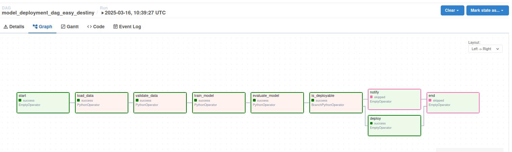

# Model Deployment Pipeline with Apache Airflow

This project demonstrates a **model deployment pipeline** using **Apache Airflow**, deployed via **Docker Compose**. It automates the process of loading data, validating it, training a model, evaluating it, and making deployment decisions based on performance. The pipeline is dynamically generated for multiple datasets using a configuration file.

## Key Features
- **Docker Compose Setup**: Simplified deployment using Docker for easy setup and scalability.
- **Dynamic DAG Generation**: One DAG per dataset for efficient scalability.
- **PythonOperator**: Utilizes PythonOperator for managing task dependencies and passing data between tasks.
- **Branching Logic**: The pipeline uses branching to make deployment decisions based on model performance.

## Prerequisites
Before you can run this project, make sure you have the following installed:

- **Docker**: Install Docker by following the official [Docker installation guide](https://docs.docker.com/get-docker/).
- **Docker Compose**: Install Docker Compose by following the official [Docker Compose installation guide](https://docs.docker.com/compose/install/).


### Key Files
- **`model_pipeline_dag.py`**: The main DAG definition file that defines the tasks and the workflow in Apache Airflow.
- **`datasets_config.json`**: Configuration file that defines the datasets used in the pipeline, their paths, and model save locations.
- **`docker-compose.yml`**: The Docker Compose setup that runs the project in isolated containers.
- **`README.md`**: This documentation file.

## Configuration
The datasets used in this pipeline are defined in the `dags/datasets_config.json` file. You can add or modify datasets by editing this file. Below is an example configuration:

```json
{
  "datasets": [
    {
      "name": "dataset1",
      "path": "/path/to/dataset1",
      "model_path": "/path/to/model1.pkl"
    }
  ]
}
```

- **name**: The name of the dataset.
- **path**: The path to the dataset on your local machine.
- **model_path**: The path where the trained model will be saved.

## Workflow Overview
The pipeline performs the following steps:

1. **Load Data**: The pipeline loads the train and test datasets.
2. **Validate Data**: Validates the datasets to ensure they are in the correct format.
3. **Train Model**: Trains a linear regression model on the dataset.
4. **Evaluate Model**: The model is evaluated using the Root Mean Squared Error (RMSE).
5. **Deploy/Notify**: 
   - If RMSE ≤ 500, the model is deployed.
   - If RMSE > 500, a notification is triggered instead of deployment.

## Model Explanation
- **Linear Regression**: A simple linear regression model is used in this pipeline. It predicts `trip_duration` based on the `distance` feature.
- **Training**: The model is trained using the `scipy.stats.linregress` function.
- **Evaluation**: The model’s performance is measured using the RMSE metric to assess the quality of the predictions.

## Techniques Used
- **XCom (Cross-Communication)**: XCom is used to pass data between tasks. The `train` and `test` datasets are passed using XCom, and each task pulls the data as needed.
- **BranchPythonOperator**: This operator is used to implement branching logic. It decides whether to deploy the model or send a notification based on RMSE.
- **Dynamic DAG Generation**: The pipeline allows for dynamic DAG generation from the `datasets_config.json` file, making it easy to scale for multiple datasets.

## How to Run
1. Clone the repository:
   ```bash
   git clone https://github.com/mrassiyacine/TripDuration.git
   ```
2. Modify `dags/datasets_config.json` to point to the datasets on your machine.
3. Start the Docker Compose setup:
   ```bash
   echo -e "AIRFLOW_UID=$(id -u)" > .env
   docker compose up airflow-init
   docker-compose up
   ```
4. Access the Airflow UI at `http://localhost:8080`.
5. Trigger the DAGs from the Airflow UI to start the pipeline.

## Customization
- **Adding New Datasets**: You can add new datasets by modifying the `dags/datasets_config.json` file.
- **Changing Deployment Criteria**: The `check_deployable` function in `model_pipeline_dag.py` can be updated to change the RMSE threshold for deployment.

## Troubleshooting
- **Broken DAG**: Check the Airflow logs for detailed error messages to help identify and resolve any issues.
- **Docker Issues**: Ensure that Docker and Docker Compose are properly installed and running. If you face issues, try restarting Docker and rerunning `docker-compose up`.

## Example Dag 

